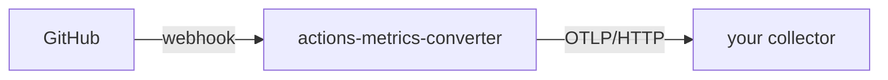

# actions-metrics-converter

Receives GitHub Actions webhook events and emits them as OpenTelemetry traces. Each completed `workflow_job` or `workflow_run` event becomes a pair of spans — one covering queue time and one covering execution time — grouped under a shared TraceID derived from the workflow run ID.

## How it works



The service:
1. Validates the `X-Hub-Signature-256` header on every incoming request.
2. Ignores everything except `workflow_job` and `workflow_run` events with `action: completed`.
3. Converts each event to two OTel spans (`<name>: queue` and `<name>: run`) with timing and metadata attributes.
4. Exports spans via OTLP HTTP to whatever endpoint `OTEL_EXPORTER_OTLP_ENDPOINT` points at.

All jobs from the same workflow run share a TraceID (derived deterministically from the run ID), so they appear as a coherent trace in your backend.

## Environment variables

| Variable | Required | Description |
|---|---|---|
| `GITHUB_WEBHOOK_SECRET` | Yes | Shared secret configured in the GitHub webhook settings. The service refuses to start without it. |
| `OTEL_EXPORTER_OTLP_ENDPOINT` | Yes (in practice) | Base URL of your OTLP HTTP collector, e.g. `http://otel-collector.observability:4318`. |
| `FAILED_PAYLOAD_DIR` | No | Directory where payloads that fail to unmarshal are written for inspection. Defaults to `.` (current directory). |
| Any `OTEL_*` variable | No | Standard OpenTelemetry SDK env vars are honoured, e.g. `OTEL_EXPORTER_OTLP_HEADERS` for auth tokens. |

## Endpoints

| Path | Method | Description |
|---|---|---|
| `/` | `POST` | GitHub webhook receiver |
| `/health` | `GET` | Health check — returns build info as JSON |

The server listens on port **3018**.

---

## Kubernetes (Helm)

The recommended deployment path. The chart lives in `charts/actions-metrics-converter`.

### Quick start

```bash
helm install actions-metrics-converter ./charts/actions-metrics-converter \
  --set githubWebhookSecret.value=<your-secret> \
  --set otel.exporterOtlpEndpoint=http://otel-collector.observability:4318
```

### Exposing the webhook endpoint

The chart uses a [Contour](https://projectcontour.io/) `HTTPProxy` for ingress. Enable it and point it at a hostname that GitHub can reach:

```yaml
ingress:
  enabled: true
  host: actions-metrics.example.com
  tls:
    secretName: actions-metrics-tls  # name of a Secret holding the cert, or leave empty for HTTP
```

Configure the GitHub webhook to send `workflow_job` and `workflow_run` events to `https://actions-metrics.example.com/`.

### TLS with cert-manager

The chart exposes the service through a Contour `HTTPProxy`, **not** a standard Kubernetes `Ingress`. Because there is no `Ingress` object, cert-manager's ingress-shim (the `cert-manager.io/cluster-issuer` annotation that auto-provisions certs) does **not** apply here. You must create a cert-manager `Certificate` yourself and point the chart at the Secret it produces.

Apply a `Certificate` in the same namespace as the release:

```yaml
apiVersion: cert-manager.io/v1
kind: Certificate
metadata:
  name: actions-metrics-tls
spec:
  secretName: actions-metrics-tls        # cert-manager writes the cert here
  issuerRef:
    name: letsencrypt-prod               # your ClusterIssuer / Issuer
    kind: ClusterIssuer
  dnsNames:
    - actions-metrics.example.com
```

Then reference that Secret from your values:

```yaml
ingress:
  enabled: true
  host: actions-metrics.example.com
  tls:
    secretName: actions-metrics-tls      # matches Certificate.spec.secretName
```

cert-manager generates and renews the certificate into the `actions-metrics-tls` Secret, and the `HTTPProxy` serves it. The same pattern works for any other source of a TLS Secret (manually created, External Secrets, corporate PKI) — just set `tls.secretName` to the Secret's name.

### Webhook secret

By default the chart creates a `Secret` from `githubWebhookSecret.value`. If you manage secrets externally (e.g. with Vault or External Secrets Operator), point at an existing secret instead:

```yaml
githubWebhookSecret:
  existingSecret: my-webhook-secret
  key: webhook-secret          # key within the Secret (default)
```

### OTEL configuration

```yaml
otel:
  exporterOtlpEndpoint: http://otel-collector.observability:4318

# Pass additional OTEL_* variables (e.g. auth headers for Honeycomb/Grafana Cloud):
extraEnv:
  - name: OTEL_EXPORTER_OTLP_HEADERS
    value: "x-honeycomb-team=your-api-key"
```

### Failed payload directory

Payloads that cannot be unmarshalled are written to `failedPayloadDir` (default `/var/lib/actions-metrics-converter/failed-payloads`) which is backed by an `emptyDir` volume. The files are lost when the pod is deleted. To retain them, replace the volume with a PVC or ship the directory to object storage via a sidecar.

### Full values reference

```yaml
replicaCount: 1

image:
  repository: ghcr.io/0x4a5700/actions-metrics-converter
  pullPolicy: IfNotPresent
  tag: ""                    # defaults to chart appVersion

githubWebhookSecret:
  existingSecret: ""
  key: webhook-secret
  value: ""

otel:
  exporterOtlpEndpoint: ""

failedPayloadDir: /var/lib/actions-metrics-converter/failed-payloads

extraEnv: []

service:
  type: ClusterIP
  port: 80

ingress:
  enabled: false
  host: ""
  annotations: {}
  tls:
    secretName: ""

resources: {}
nodeSelector: {}
tolerations: []
affinity: {}
```

---

## Standalone binary

### Build

```bash
cd app
go build -o actions-metrics-converter .
```

To embed build metadata (shown in the `/health` response):

```bash
go build \
  -ldflags "-X main.buildVersion=1.2.3 -X main.gitHash=$(git rev-parse HEAD) -X main.buildDate=$(date -u +%Y-%m-%dT%H:%M:%SZ)" \
  -o actions-metrics-converter .
```

### Run

```bash
export GITHUB_WEBHOOK_SECRET=<your-secret>
export OTEL_EXPORTER_OTLP_ENDPOINT=http://localhost:4318
./actions-metrics-converter
```

The server starts on port 3018. Send a test request:

```bash
# Compute signature for an empty body
SECRET=your-secret
SIG=$(echo -n '{}' | openssl dgst -sha256 -hmac "$SECRET" | awk '{print "sha256="$2}')

curl -s -X POST http://localhost:3018/ \
  -H "X-GitHub-Event: workflow_job" \
  -H "X-Hub-Signature-256: $SIG" \
  -H "Content-Type: application/json" \
  -d '{}'
```

### Docker

```bash
docker build \
  --build-arg gitHash=$(git rev-parse HEAD) \
  --build-arg buildVersion=dev \
  -t actions-metrics-converter .

docker run --rm \
  -e GITHUB_WEBHOOK_SECRET=<your-secret> \
  -e OTEL_EXPORTER_OTLP_ENDPOINT=http://host.docker.internal:4318 \
  -p 3018:3018 \
  actions-metrics-converter
```

---

## Configuring the GitHub webhook

In your repository or organisation settings:

1. **Payload URL** — the public URL of the service (`/`).
2. **Content type** — `application/json`.
3. **Secret** — must match `GITHUB_WEBHOOK_SECRET`.
4. **Events** — select **Workflow jobs** and **Workflow runs** (or "Send me everything").
